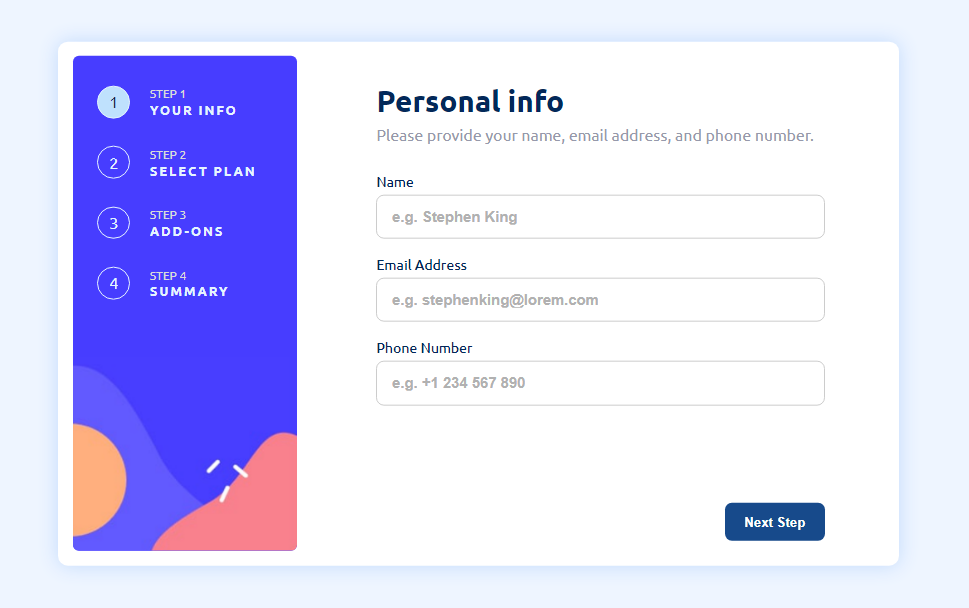
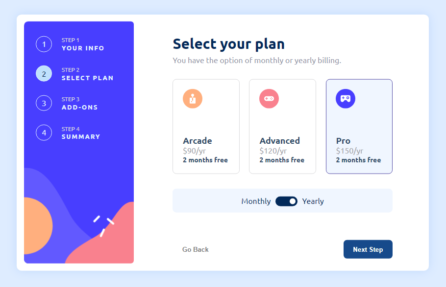
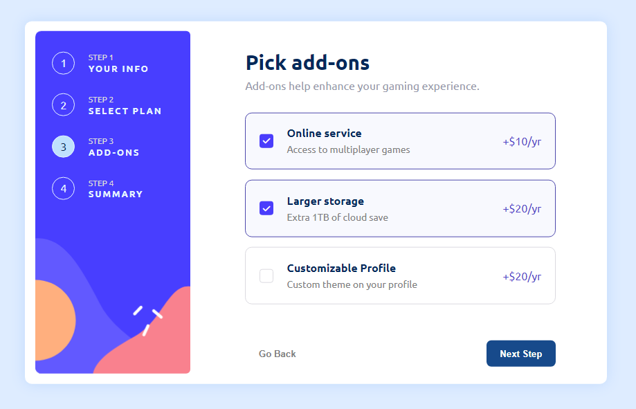
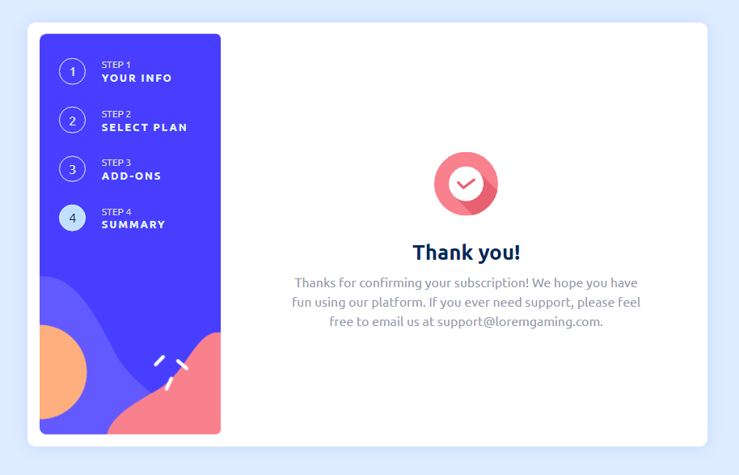
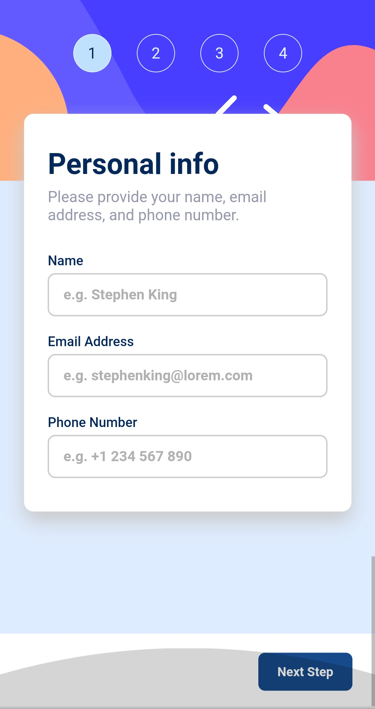
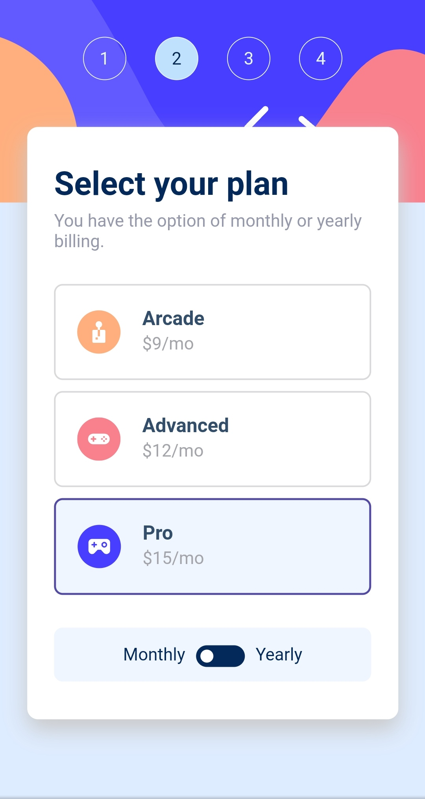
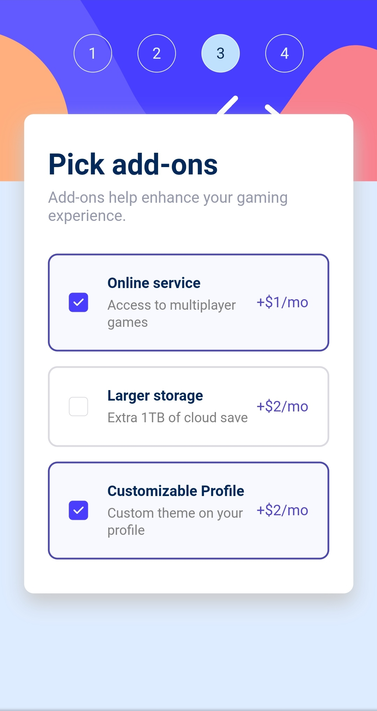
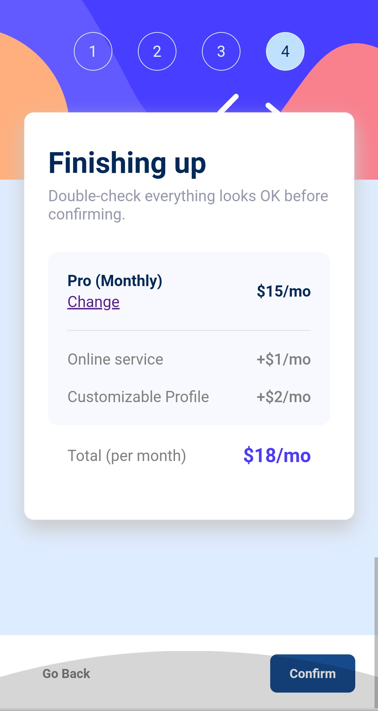

# Frontend Mentor's challenge - Multi-step form

This is a solution to the [Multi-step form challenge on Frontend Mentor](https://www.frontendmentor.io/challenges/multistep-form-YVAnSdqQBJ). Frontend Mentor challenges help you improve your coding skills by building realistic projects.

**Check live url here : [Multi-step Form](https://dvloper-ibrahim.github.io/Multi-Step-Form/)**

## Table of contents

- [Overview](#overview)
  - [The challenge](#the-challenge)
  - [Screenshots](#screenshots)
  - [Links](#links)
- [My process](#my-process)
  - [Built with](#built-with)
  - [What I learned](#what-i-learned)
  - [Continued development](#continued-development)
  - [Useful resources](#useful-resources)
- [Author](#author)
- [Acknowledgments](#acknowledgments)

## Overview

### The challenge

Users should be able to:

- Complete each step of the sequence
- See a summary of their selections on the final step and confirm their order
- View the optimal layout for the interface depending on their device's screen size
- See hover and focus states for all interactive elements on the page

### Screenshots

For desktop and large screens :

For landscape tablets and mobile phones :

### Links

- Solution URL: [Solution's repository](https://github.com/Dvloper-Ibrahim/Multi-Step-Form)
- Live Site URL: [Multi-step Form](https://dvloper-ibrahim.github.io/Multi-Step-Form/)

## My process

### Built with

- Semantic HTML5 markup
- CSS custom properties
- Flexbox
- CSS Grid
- Desktop-first workflow
- Vanilla JavaScript

### What I learned

At first, I wanted to implement the challenge using a framework or library like `React.js`.

But to get some challenging tasks and face more confused bugs , I used vanilla javascript so as to being familiar with these bugs.

### Continued development

I'm planning for setting an algorithm that force the user to input his personal info (name, email, phone) in some way and get more valid data from him.

### Useful resources

- [Responsive Web Design - Media Queries](https://www.w3schools.com/css/css_rwd_mediaqueries.asp) - This helped me for responsive design and I want to know the standard dimensions for the media queries.

## Author

- Linkedin - [Ibrahim Ahmed](https://www.linkedin.com/in/developer-ibrahim/)
- Frontend Mentor - [@Dvloper-Ibrahim](https://www.frontendmentor.io/profile/Dvloper-Ibrahim)
- Twitter - [@Dvloper_Ibrahim](https://twitter.com/Dvloper_Ibrahim)
